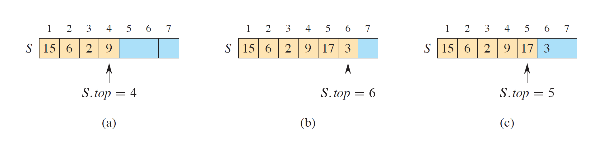
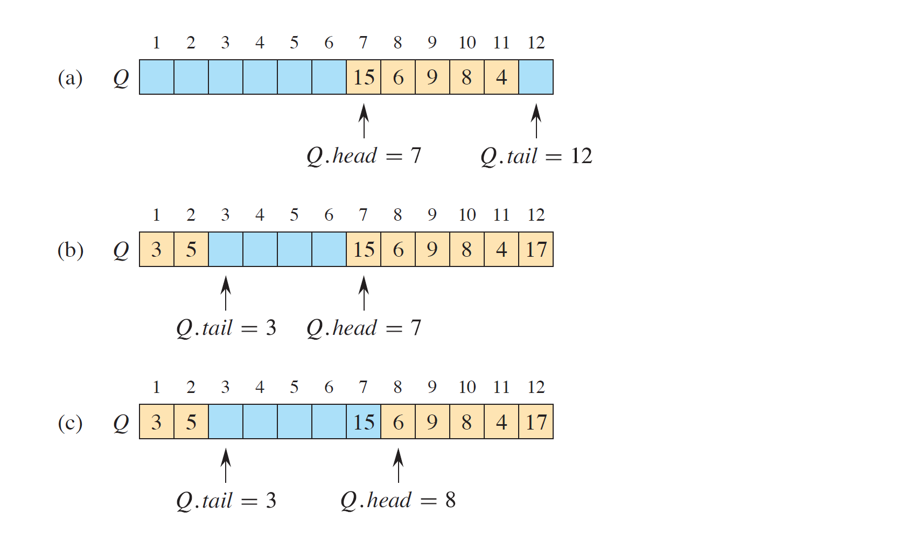
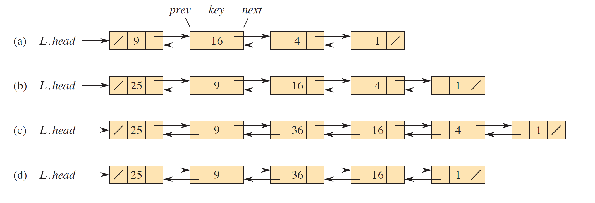
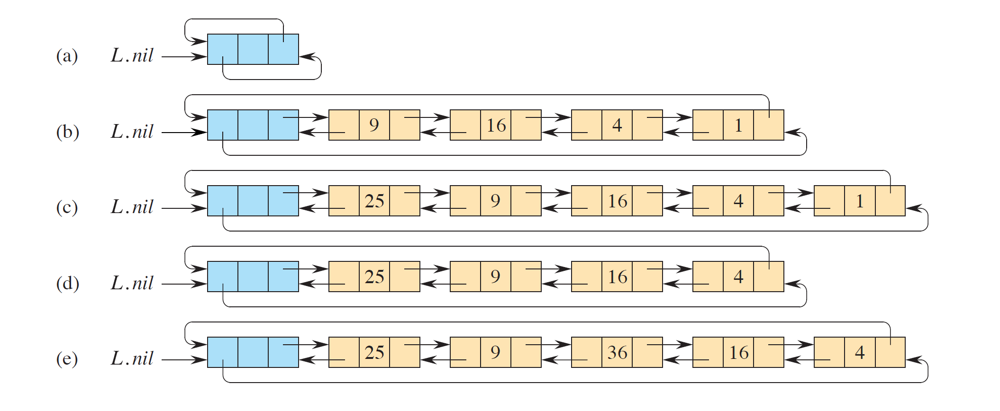
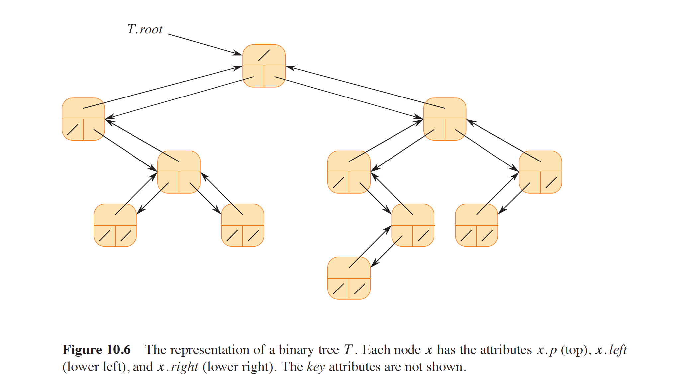
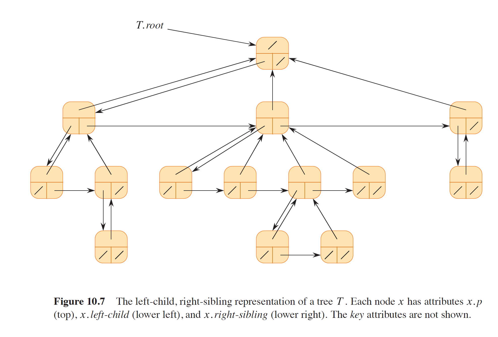

## $Operations~on~dynamic~sets$

动态集合 (dynamic sets) 有两类操作：queries 查询和 modifying operations 修改。

具体来说，分为

- Search 查询
- Insert 插入
- Delete 删除
- Minimum and Maximum 找最值
- Successor 找后继
- Predecessor 找前驱

## $Simple~array-based~DS$

可参照原书 pseudocode 自行编写代码——[重在理解](../code/Chapter10/Exercises/10.1-7.md)

### _Arrays_ 数组

略

### _Matrices_ 矩阵

略

### [_Stacks_](../code/Chapter10/Text/10.1.1_lifoStack.c) 栈

性质：

- 后进先出 LIFO: last-in, first-out
- 插入函数为 Push（推入），删除函数为 Pop（弹出）
- 无元素的栈为 empty，栈满了还 push 则 overflow（向上溢出），栈空了还 pop 则 underflow(向下溢出)

注意，栈 (stack) 不是堆 (heap) 。

### [_Queues_](../code/Chapter10/Text/10.1.2_fifoQueue.c) 队列

性质：

- 先进先出 FIFO: first-in, first-out
- 插入函数为 Enqueue（入队），删除函数为 Dequeue（出队）
- 有头 (head) 和尾 (tail) ，从尾部 enqueue，从头部 dequeue

## $Linked~lists$ 链表

性质：

- 可以循环 (circular) ，可以双向 (doubly) ，可以有序 (sorted)
- 作为 dynamic sets 的典型代表，链表可以实现之前提到的所有操作

操作：

- 双向数组[示例](../code/Chapter10/Text/10.2.1_doublyLinkedList.c)

  可通过单指针与异或值取代双指针，详见 Exercise [10.2-6](../code/Chapter10/Exercises/10.2-6_DLLwithXORandSingleptr.c)

- 有哨兵节点 (Sentinel) 的双向循环链表[示例](../code/Chapter10/Text/10.2.2_dllSentinel.c)

注意，这些“数据结构”不是由数据类型决定的，而是[由操作定义](../code/Chapter10/Exercises/10.2-2.md)的种种“结构”。

## $Rooted~trees$ 有根树

特征：

1. 有且只有一个根节点
2. 除根节点外，每个子节点有且只有一个父节点
3. 有层次结构

### _Binaty trees_ 二叉树

节点组成：

- parent 父节点
- left child 左子节点
- right child 右子节点

### _Rooted trees with unbounded branching_ 无界多叉树

节点组成：

- parent 父节点
- left child 左子节点
- right sibling 右兄弟节点

