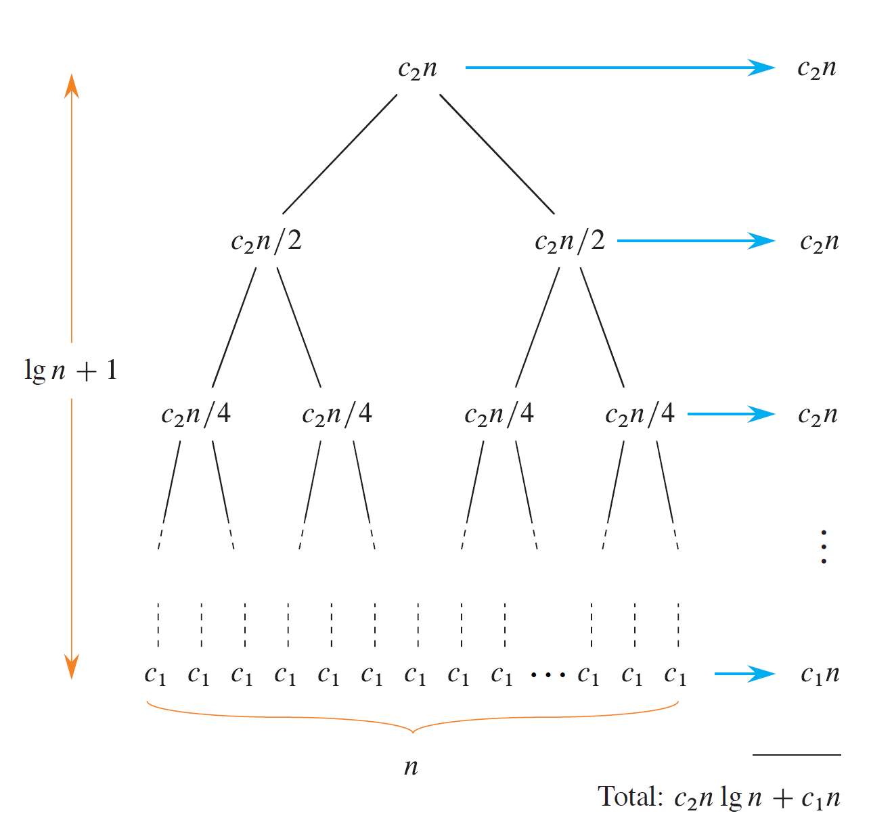

## $Mathematical ~ Induction$ & $Loop ~ Invariant$ <br>数学归纳法与循环不变量

以插入排序 _Insertion sort_ 为例

1. ### _Initialization_

   在开始插入卡片前，已经存在第一张卡片，其已然有序，已然为循环不变量。

2. ### _Maintenance_

   插入第 i 张卡牌时，从右往左将已有卡牌依次像右移动一格，直到找到适合第 i 张的位置。这个过程并不改变原有数组的相对大小关系，即循环不变量。此时，对于下一次插入而言，数组已然有序。

3. ### _Termination_

   即将插入不存在的第 n + 1 张牌时，循环显然要终结，而由第二步得，相对于第 n+1 张而言，前 n 张已然有序，即原数组已然完成排序。证毕。

## $Incremental$ method <br>递增法$^?$

For each element _A[i]_, insert it into its proper place in the subarray _A[1:i]_, having already sorted the subarray _A[1:i-1]_.

以插入排序 _Insertion sort_ 为例，代码如下:

```c
void insertionSort(int arr[], int n)
{
    int i, key, j;
    for (i = 1; i < n; i++)
    {
        key = arr[i];
        // Insert arr[i] into the sorted subarray
        j = i - 1;
        while (j >= 0 && arr[j] > key)
        {
            arr[j + 1] = arr[j];
            j = j - 1;
        }
        arr[j + 1] = key;
    }
}
```

## $Divide-and-Conquer$ method <br>分治

### _Base case_

If the problem is small enough, just solve it directly without recursing.

### _Recursive case_

Otherwise, perform three characteristic steps:

1. Divide the problem into one or more subproblems that are smaller instances of the same problem.
2. Conquer the subproblems by solving them recursively.
3. Combine the subproblem solutions to form a solution to the original problem.

以归并排序 _Merge sort_ 为例，代码和可视化见 [SORT VISUALIZER](https://www.sortvisualizer.com/mergesort/) 及 [VISUALGO](https://visualgo.net/en/sorting)：

```c
void merge(int arr[], int l, int m, int r)
{
    int i, j, k;
    int n1 = m - l + 1; // length of the left half of A
    int n2 = r - m;     // length of the right half of A

    int L[n1], R[n2]; // valid

    for (i = 0; i < n1; i++)
        L[i] = arr[l + i]; // copy left part into L
    for (j = 0; j < n2; j++)
        R[j] = arr[m + 1 + j]; // copy right part into R

    i = 0; // the smallest remaining element in L
    j = 0; // the smallest remaining element in R
    k = l; // the location in A to fill
    // As long as each of the arrays L and R contains an unmerged element,
    //     copy the smallest unmerged element back into array A.
    while (i < n1 && j < n2)
    {
        if (L[i] <= R[j])
        {
            arr[k] = L[i];
            i++;
        }
        else
        {
            arr[k] = R[j];
            j++;
        }
        k++;
    }
    // Having gone through one of L and R entirely,
    //     copy the remainder of the other to the end of A.
    while (i < n1)
    {
        arr[k] = L[i];
        i++;
        k++;
    }
    while (j < n2)
    {
        arr[k] = R[j];
        j++;
        k++;
    }
}

void mergeSort(int arr[], int l, int r)
{
    // if zero or one element, return directly
    if (l < r)
    {
        int m = l + (r - l) / 2;  // midpoint of A
        mergeSort(arr, l, m);     // recursively sort left part of A
        mergeSort(arr, m + 1, r); // recursively sort right part of A
        // Merge two halves
        merge(arr, l, m, r);
    }
}
```

### 理解时间复杂度 $O$$(n$log$n)$

_recursion tree_ 如图 
