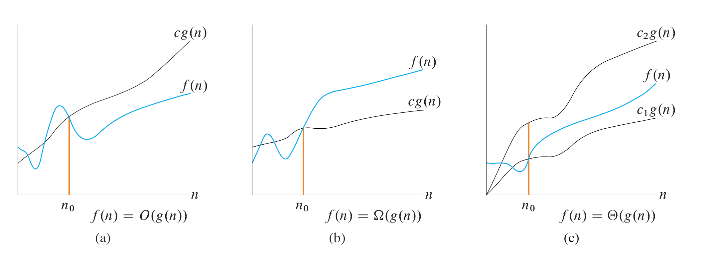
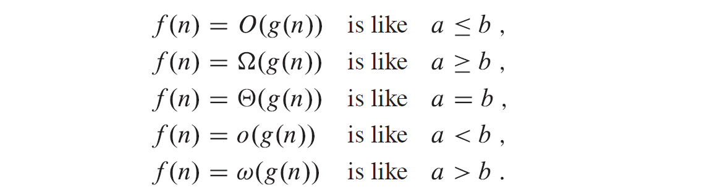
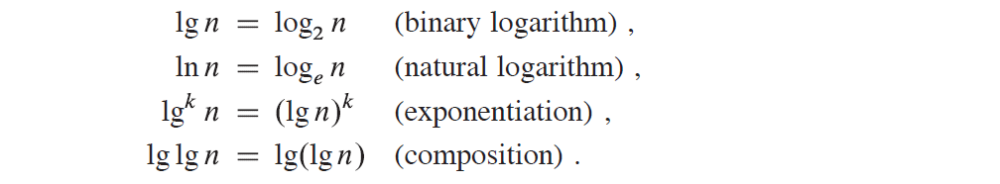
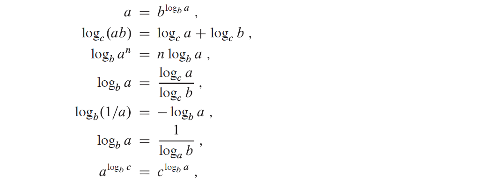

## $Notations$

### $O$-_notation_

$O$-notation characterizes an _upper bound_ on the asymptotic behavior of a function.

意为 _no faster than_

### $\Omega$-_notation_

$\Omega$-notation characterizes a _lower bound_ on the asymptotic behavior of a function.

意为 _at least as fast as_

### $\Theta$-_notation_

$\Theta$-notation characterizes a _tight bound_ on the asymptotic behavior of a function.

意为 grows _precisely_ at a certain rate，
表征了一种精确的渐进行为

        注意，插入排序的 best-case 为原数组已然正序，此时时间复杂度的下界当然为 Omega(n), 但是原书这一章第一节考虑的对象始终是 "the worst-case running time" ，并以此来计算 Omega。
        而这样才更接近于考虑“所有输入”，更接近于现实。

## $Formal ~ Definition$

前提条件：所有函数非负

1. ### $O$-notation

表征 **_asymptotic upper bound_**

<!-- $O(g(n))$ $=$ $\{$ $f(n)$ $:$ there exist positive constants $c$ and $n_0$ such that 0 $\leqslant$ $f(n)$ $\leqslant$ $cg(n)$ for all $n$ $\geqslant$ $n_{\scriptstyle 0}$ $\}$ -->

$$
\begin{aligned}
O(g(n)) = \{~f(n) :
&\text{ there exist positive constants }c\text{ and }n_{\scriptstyle 0} \text{ such that } \\
&~0 \leqslant f(n) \leqslant c g(n) \text{ for all } n \geqslant n_{\scriptstyle 0}~\}
\end{aligned}
$$

2. ### $\Omega$-notation

表征 **_asymptotic lower bound_**

<!-- $\Omega(g(n))$ $=$ $\{$ $f(n)$ $:$ there exist positive constants $c$ and $n_0$ such that 0 $\leqslant$ $cg(n)$ $\leqslant$ $f(n)$ for all $n$ $\geqslant$ $n_{\scriptstyle 0}$ $\}$ -->

$$
\begin{aligned}
\Omega(g(n)) = \{~f(n) :
&\text{ there exist positive constants }c\text{ and }n_{\scriptstyle 0} \text{ such that } \\
&~0 \leqslant c g(n) \leqslant f(n) \text{ for all } n \geqslant n_{\scriptstyle 0}~\}
\end{aligned}
$$

3. ### $\Theta$-notation

表征 **_asymptotically tight bounds_**

<!-- $\Theta(g(n))$ $=$ $\{$ $f(n)$ $:$ there exist positive constants $c_{\scriptstyle 1}$, $c_{\scriptstyle 2}$ and $n_{\scriptstyle 0}$ such that $0 \leqslant c_{\scriptstyle 1} g(n) \leqslant f(n) \leqslant c_{\scriptstyle 2} g(n)$ for all $n \geqslant n_{\scriptstyle 0}$ $\}$ -->

$$
\begin{aligned}
\Theta(g(n)) = \{~f(n) :
&\text{ there exist positive constants } c_{\scriptscriptstyle 1}, c_{\scriptscriptstyle 2} \text{ and }n_{\scriptstyle 0} \text{ such that } \\
&~0 \leqslant c_{\scriptstyle 1} g(n) \leqslant f(n) \leqslant c_{\scriptstyle 2} g(n) \text{ for all } n \geqslant n_{\scriptstyle 0}~\}
\end{aligned}
$$

### $Theorem~3.1$

we have $f(n) = \Theta(g(n))$ if and only if $f(n) = O(g(n))$ and $f(n) = \Omega(g(n))$

4. ### $o$-notation

<!-- $o(g(n))$ $=$ $\{$ $f(n)$ $:$ for any positive constant $c > 0$, there exists a constant $n_{\scriptstyle 0} > 0$ such that $0 \leqslant f(n) < cg(n)$ for all $n \geqslant n_{\scriptstyle 0}$ $\}$ -->

$$
\begin{aligned}
o(g(n)) = \{~f(n) :
&\text{ for any positive constant } c>0, \text{ there exists a constant }\\
&~n_{\scriptstyle 0} > 0 \text{ such that } 0 \leqslant f(n) < cg(n) \text{ for all } n \geqslant n_{\scriptstyle 0}~\}
\end{aligned}
$$

表征宽松的上界， $\displaystyle \lim_{n \to 0}\frac{f(n)}{g(n)} = 0$

5. ### $\omega$-notation

<!-- $\omega(g(n))$ $=$ $\{$ $f(n)$ $:$ for any positive constant $c > 0$, there exists a constant $n_0 > 0$ such that $0 \leqslant cg(n) < f(n)$ for all $n \geqslant n_0$ $\}$ -->

$$
\begin{aligned}
\omega(g(n)) = \{~f(n) :
&\text{ for any positive constant } c>0, \text{ there exists a constant }\\
&~n_{\scriptstyle 0} > 0 \text{ such that } 0 \leqslant cg(n) < f(n) \text{ for all } n \geqslant n_{\scriptstyle 0}~\}
\end{aligned}
$$

表征宽松的下界，$\displaystyle \lim_{n \to 0}\frac{f(n)}{g(n)} = \infty$

### extra

另有多元函数的表示方法，详见 Exercise [3.2-7](../code/chapter3/Exercises/3.2-7.md)

$\widetilde{O}~O^{'}~\overset{\infty}{\Omega}~\widetilde{\Omega}~\widetilde{\Theta}$ 见 Problem [3-6](../code/Chapter3/Problems/3-6.md)

## 理解与运用

### _No Overstating_ 不要泛泛而谈

可以说插入排序在 best-case 下的时间复杂度为$\Theta(n)$，也可以说在 worst-case 下的时间复杂度为$\Theta(n^2)$，但是不能说它恒为其中某一个，而必须加上前提条件。

当然，$O(n^2)$和$\Omega(n)$始终成立。

    记号只是为了用尽量精确而简便的方式表征。

### 相信直觉

一些细则详见原书，日常情况就运用你的“计算机直觉”吧。 —— Just focus on what really matters.

## $Math$

详见原书（我指的是《工科数学分析》）——that's not funny.

建议直接进入[第四章](Chapter4.md)

1.  ### _Monotonicity_ 单调性

    分为单调递增（可取等）与严格递增（不可取等）

2.  ### _Floors and ceilings_ 向下取整与向上取整

    $\lfloor x \rfloor :$ the floor of x

    $\lceil x \rceil :$ the ceiling of x

    $x - 1 < \lfloor x \rfloor \leqslant x \leqslant \lceil x \rceil < x + 1$

    注意，截断 truncation 和四舍五入 round 在处理时不考虑正负号

3.  ### _Modular arithmetic_ 取模运算

    对于任意整数 $a$ 和正整数 $n$， 有
    $$a \text{ mod } n = a - n\lfloor a/n \rfloor$$
    注意，就算 a 为负数，模数任然非负

4.  ### _Polynomials_ 多项式

    定义 a polynomial in n of degree d: $~p(n) = \sum \limits _{i=0}^{d}a_in^i$

    定义多项式有界$^?$ polynomially bounded:
    $$~f(n) = O(n^k)$$

5.  ### _Exponentials_ 指数函数

    （你甚至需要掌握泰勒展开）

6.  ### _Logarithms_ 对数函数

    定义如下
    <!--  -->

    $$
    \begin{align*}
    \lg n &= \log_2 n &\text{(binary logarithm)} \\
    \ln n &= \log_e n &\text{(natural logarithm)} \\
    \lg^k n &= (\lg n)^k &\text{(exponentiation)} \\
    \lg \lg n &= \lg(\lg n) &\text{(composition)}
    \end{align*}
    $$

    运算性质如下
    <!--  -->

    $$
    \begin{align*}
    a &= b^{\log_b a} \\
    \log_c(ab) &= \log_c a + \log_c b \\
    \log_b a^n &= n \log_b a \\
    \log_b a &= \frac{\log_c a}{\log_c b} \\
    \log_b(1/a) &= -\log_b a \\
    \log_b a &= \frac{1}{\log_a b} \\
    a^{\log_b c} &= c^{\log_b a}
    \end{align*}
    $$

    定义对数多项式有界$^?$ polylogarithmically bounded:
    $$~f(n) = O(\lg^k n) = O((\lg n)^k)$$

7.  ### _Factorials_ 阶乘

    斯特林近似 _Stirling's approximation_:  
    $$n!=\sqrt{2 \pi n}\left(\frac{n}{e}\right)^{n}\left(1+\Theta\left(\frac{1}{n}\right)\right)$$

    also:
    $$n! = \sqrt{2 \pi n}\left(\frac{n}{e}\right)^{n} e^{\alpha_{n}}$$
    $\text{ where } n \geqslant 1 \text{ and } \frac{1}{12n+1} < \alpha_n < \frac{1}{12n}$

    更多内容见 Exercise [3.3-4](../code/Chapter3/Exercises/3.3-4.md)

8.  ### _Functional iteration_ 函数式迭代

    $$
    f^{(i)}(n) =
    \begin{cases}
    \begin{aligned}
    &n & \text{if } i = 0\\
    &f(f^{(i - 1)}(n)) & \text{if } i > 0
    \end{aligned}
    \end{cases}
    $$

    例如，$f(n)=2n \Longrightarrow f^{(i)}(n)=2^in$

9.  ### _iterated logarithm function_ 迭代对数函数

    根据上面的迭代函数，定义函数 $\lg^{(i)}n$ ，并定义 $\lg^* n$ ，于是有以下迭代对数函数：
    $$\lg^* n = \min \{i \geqslant 0 : \lg^{(i)}n \leqslant 1 \}$$
    例如

    $\begin{aligned}
    \lg^* 2 &= 1\\
    \lg^* 4 &= 2\\
    \lg^* 16 &= 3\\
    \lg^* 65536 &= 4\\
    \lg^* (2^{65536}) &= 5\\
    \lg^* (\lg n) &= \lg^*n-1
    \end{aligned}$

    一般迭代函数见 Problem [3-7](../code/Chapter3/Problems/3-7.md)

10. ### Fibonacci numbers

    $$
    F_i =
    \begin{cases}
    \begin{aligned}
    &0 & \text{if } i = 0\\
    &1 & \text{if } i = 1\\
    &F_{i-1}+F_{i-2} & \text{if } i \geqslant 2
    \end{aligned}
    \end{cases}
    $$

    $F_i$与黄金分割率 $\phi$ 及其共轭 $\hat\phi$ ( the two roots of $x^2=x+1$ )有如下关系：
    $$F_i = \frac{\phi^i - \hat\phi^i}{\sqrt{5}}$$
    也即

    $$
    F_i = \lfloor \frac{\phi^i}{\sqrt{5}}+\frac{1}{2}\rfloor
    $$

    证明见 Exercise [3.3-8](../code/Chapter3/Exercises/3.3-8.md)

  
数学果然是理工科的基础

