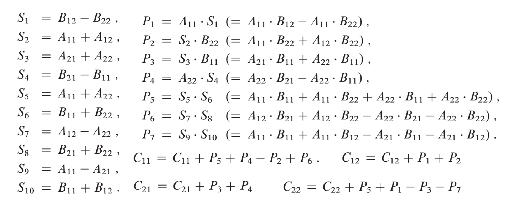

## $Divide-and-Conquer$  分治

### _base case:_

just solve it without recursing

### _recursive case:_

**Devide** the porblem into one or more subproblems  
**Conquer** the subproblems by solving them recursively  
**Combine** the subproblems solutions to form a solution to the original problem  

递归（recurrence）分割问题直至触底（base case），而后合并

## $Multiplying~Square~Matrices$  方阵相乘

有方阵 $A, B$，以及初始化为 0 的方阵 $C$, 有 $C=A\cdot B$，即 $c_{ij}=\sum\limits_{k=1}^{n}a_{ik}\cdot b_{kj}$

1. ### _Straightforward calculation_

   直接乘，完全套公式。[4.1](../code/Chapter4/Text/4.1.1_matrixMultiply.c)

   显然 $T(n)=\Theta(n^3)$

2. ### _Simple divide-and-conquer_

   将每个方阵分为 4 个小方阵，分块矩阵乘法。[4.2](../code/Chapter4/Text/4.1.2_matrixMultiplyRecursive.c)

   时间复杂度：$T(n)=8T(n/2)+\Theta(1) \Longrightarrow   T(n)=\Theta(n^3)~~~$ 详见[master method](#mst)

3. ### _Strassen's algorithm_

   Remarkable! 太神奇了！ 用加法换乘法，竟然只用算 7 个方阵乘法，使时间复杂度大大减小！

   时间复杂度：$T(n)=7T(n/2)+\Theta(n^2) \Longrightarrow T(n)=\Theta(n^{\lg 7})=O(n^{2.81}) \ll O(n^3)~~~$ 详见[master method](#mst)

   原理如下图，伪代码见 [Strassen](../imgs/4.2.png)，代码见 Exercise [4.2-2](../code/Chapter4/Exercises/4.2-2.c)
   

## $Solving~Recurrences$  分析递归式

三种方法以计算递归式（复现）的时间复杂度 $O,\Theta,\Omega$

1. ### _Substitution method_

   step 1. Guess the form of the solution using symbolic constants.

   step 2. Use mathematical induction to show that the solution works, and find the constants.

   先猜出函数，再用数学归纳法证明

2. ### _Recursion-tree method_

3. ### _master method_

   
个人认为这本书写的真好，真有结构，循循善诱，由浅入深。 
同时覆盖广、讲解深，完美适配从入门到入土&#128514;

