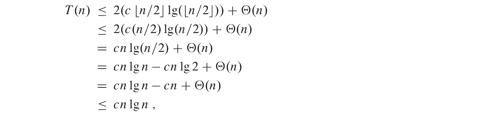

## $Divide-and-Conquer$  分治

### _base case:_

- just solve it without recursing

### _recursive case:_

- **Devide** the porblem into one or more subproblems  
- **Conquer** the subproblems by solving them recursively  
- **Combine** the subproblems solutions to form a solution to the original problem  

递归（recurrence）分割问题直至触底（base case），而后合并

## $Multiplying~Square~Matrices$  方阵相乘

有方阵 $A, B$，以及初始化为 0 的方阵 $C$, 有 $C=A\cdot B$，即 $c_{ij}=\sum\limits_{k=1}^{n}a_{ik}\cdot b_{kj}$

1. ### _Straightforward calculation_

   直接乘，完全套公式。[4.1](../code/Chapter4/Text/4.1.1_matrixMultiply.c)

   显然 $T(n)=\Theta(n^3)$

2. ### _Simple divide-and-conquer_

   将每个方阵分为 4 个小方阵，分块矩阵乘法。[4.2](../code/Chapter4/Text/4.1.2_matrixMultiplyRecursive.c)

   时间复杂度：$T(n)=8T(n/2)+\Theta(1) \Longrightarrow   T(n)=\Theta(n^3)~~~$ 详见[master method](#mst)

3. ### _Strassen's algorithm_

   Remarkable! 太神奇了！ 用加法换乘法，竟然只用算 7 个方阵乘法，使时间复杂度大大减小！

   时间复杂度：$T(n)=7T(n/2)+\Theta(n^2) \Longrightarrow T(n)=\Theta(n^{\lg 7})=O(n^{2.81}) \ll O(n^3)~~~$ 详见[master method](#mst)

   原理如下图，伪代码见 [Strassen](../imgs/Ch4/4.2.png)，代码见 Exercise [4.2-2](../code/Chapter4/Exercises/4.2-2.c)
   

## $Solving~Recurrences$  分析递归式

三种方法以计算递归式（复现）的时间复杂度 $O,\Theta,\Omega$

1.  ### _Substitution method_ 代换法

    two steps: 先猜后证（主打一个熟能生巧）

    - Guess the form of the solution using symbolic constants.

    - Use mathematical induction to show that the solution works, and find the constants.

    示例如图：

    &#8195;&#8195;&#8194; $T(n)=2T(\lfloor n/2\rfloor)+\Theta(n)$ ，猜测 $T(n)=O(n\lg n)$ ，然后套用大 O 的定义，设定 $n_{\scriptsize 0}$ 和常数 $c$ ，当 $n>2n_{\scriptsize 0}$ 时，有  （一般来说证道这里就行了，但这版算法导论更加严谨）

    两点技巧：

    - 只关注与 n 有关的项，相似的递推式有相似的解。例如，$2T(n/2+17)\to 2T(n/2)$

    - 可以先找到宽松的上下界，然后锁紧夹逼——对掌握[函数相对大小](../code/Chapter3/Problems/3-3.md)要求较高

    三点心得：

    - 猜出函数后的证明就像数分中的一些极限相关证明，$n_{\scriptscriptstyle 0}$ 是 $N$，$c$ 是 $\varepsilon$ 。而这种题主打一个（在草稿纸上）先写出关系再设定参数范围。
    - 对于简单的递推式，其实可以换元，例如上式可以设 $T(n)=2^k$ 。
    - 猜出函数的主体后，一些 lower terms 低阶项其实就是待定系数法。更多例题详见 Exercises

    两点陷阱：

    &#8195;&#8195;&#8194;代换法的递推式中不要出现时间复杂度记号，而应显式出现时间复杂度定义。归根结底是因为，你要通过定义证明，你所假设的固定常数 $c$ 对所有 $T(n)$ 成立。
    

2.  ### _Recursion-tree method_ 递归树法

    详见[CSDN](https://blog.csdn.net/yangtzhou/article/details/105339108)，此处只给出例图——递归树法重点就在于画出图，算出总层数、每层耗时、叶子层耗时

3.  ### _Master method_ 主定理法$^?$ 

    我们发现，递归式可以有相似的形式，于是可以用主定理解形如 $T(n)=aT(n/b)+f(n)$ (a>0, b>1) 的递归式，其中整个递推式称为 **_master recurrence_** 主递推式， $f(n)$ 称为 _**driving function**_ 驱动函数，涵盖了驱动问题解决所必须和的分隔和合并操作。值得一提的是，之前我们一直默认每一层的 n 都为整数 (floor and ceiling) ，但主定理隐式这样处理了 n。

    为了运用主定理法，首先引入主定理。

    **_Master theorem_**

    1. If there exists a constant $\epsilon>0$ such that $f(n)=O\left(n^{\log _{b} a-\epsilon}\right)$ , then $T(n)= \Theta\left(n^{\log _{b} a}\right)$ .
    2. If there exists a constant $k \geqslant 0$ such that $f(n)=\Theta\left(n^{\log _{b} a} \lg ^{k} n\right)$ , then $T(n)= \Theta\left(n^{\log _{b} a} \lg ^{k+1} n\right)$ .
    3. If there exists a constant $\epsilon>0$ such that $f(n)=\Omega\left(n^{\log \_{b} a+\epsilon}\right)$ , and if $f(n)$ additionally satisfies the regularity condition $af(n/b) \leq c f(n)$ for some constant $c<1$ and all sufficiently large $n$ , then $T(n)=\Theta(f(n))$ .

    理解：

    &#8195;&#8195;&#8194;$n^{\log_b a}$ 称为分水岭函数，将 $f(n)$ 与之比较，分出了上述三类。

    case 1.

    - &#8195;&#8195;在 $n^{\log_b a}$ 比 $f(n)$ 增长快得不仅 asymptotically （在远处更大，但是仅仅是宽泛的更大，大多少不确定）， 而且 **polynomially** ——增长速度的差异可用一个多项式因子 $\Theta(n^\epsilon)$ 描述，$\epsilon$ 不需要多大，但一定要有。
    - &#8195;&#8195;此时，通过观察递归树我们会发现，从根到叶每一层至少都是几何增长 **geometrically** （等比数列），使得叶子层的总时长远大于 (dominantes) 中间节点的总和。

    

    case 2.

    - &#8195;&#8195;分水岭函数与驱动函数增长得近似相等$^?$，但具体来说驱动函数比分水岭函数 $n^{\log_ba}$ 增长得多 $\Theta (\lg^k n)$ ，其中 k 非负。此时给 $f(n)=n^{\log_ba} \cdot \lg^kn$ 再叠加上一个 $\lg n$ 就是答案 $T(n)=\Theta(n^{\log_ba} \lg^{k+1}n)$ 。
    - &#8195;&#8195;此时，我们发现，递归树每一层的耗时大致相同—— $\Theta(n^{\log_ba}\lg^kn)$ ——且共有 $\Theta(\lg n)$ 层。
    - &#8195;&#8195;情形 2 最常见的情况是 $k=0$ 。

    

    case 3.

    - &#8195;&#8195;与情形 1 相对，驱动函数比分水岭函数快出一个多项式量级，且还要满足一个正则条件 (regularity condition) $af(n/b)\leqslant cf(n)$ ——大多数情形 3 的驱动函数都满足，但存在例外，见 Exercise [4.5-5](../code/Chapter4/Exercises/4.5-5.md)
    - &#8195;&#8195;此时，从根到叶每层都几何衰减，使得根层主导总用时。

    

   
个人认为这本书写的真好，真有结构，循循善诱，由浅入深。 
同时覆盖广、讲解深，适合入门&#128514;

